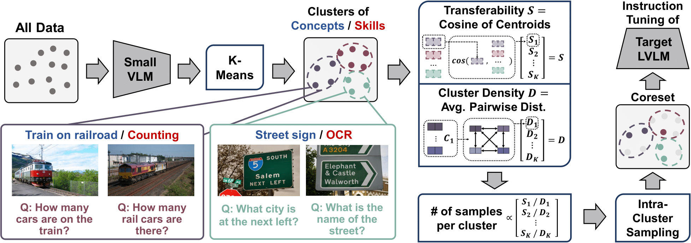

# COINCIDE

### **Concept-skill Transferability-based Data Selection for Large Vision-Language Models** <br>
EMNLP 2024
* Authors: [Jaewoo Lee](https://g-jwlee.github.io/), [Boyang Li^](http://www.boyangli.org/), [Sung Ju Hwang^](http://www.sungjuhwang.com/)
* [Paper](https://arxiv.org/abs/2406.10995)

## Introduction

Training Large Vision-Langauge Models on extensive visual instruction tuning (VIT) data incurs significant computational cost, making the process infeasible for small academic labs and individual researchers.
Additionally, it is not clear if all the VIT data are necessary for good generalization, as different vision-language (VL) tasks have different abilities to transfer to downstream tasks.

We propose COINCIDE (COre-INstruction Concept-skIll Data Election), which identifies VL concept-skill compositions through data clustering using activations from an off-the-shelf, small VLM.


<center></center>
<p>

From each cluster, COINCIDE selects training data for a target LVLM by considering transferability (i.e., how well knowledge from each cluster can facilitate LVLM's learning in other clusters) and internal density of clusters.

</p>

## Install
Since we use different models for 1. clustering and 2. training, different conda environments are required for each process.

### Clustering
```shell
conda create -n coincide_cluster python=3.10 -y
conda activate coincide_cluster
pip install --upgrade pip  # enable PEP 660 support
pip install -e .
pip install -e ".[train]"
```

### Training
```shell
conda create -n coincide_train python=3.10 -y
conda activate coincide_train
cd COINCIDE_train
pip install --upgrade pip  # enable PEP 660 support
pip install -e .
pip install -e ".[train]"
pip install flash-attn --no-build-isolation
```

## Dataset
### LLaVA-1.5
Follow the visual instruction tuning dataset download guides in the [official Github page](https://github.com/haotian-liu/LLaVA)
Place the downloaded files in `COINCIDE_train/playground/data`.
Also, prepare for the evaluation benchmark datasets by following the instructions in the page.

### Vision-Flan
Similarly, download the Vision-Flan visual instruction tuning dataset through the [official project page](https://vision-flan.github.io/)
Place the downloaded files in `COINCIDE_train/playground/data`.

## Models
In this paper, we focus on two models: [TinyLLavA-2B](https://github.com/TinyLLaVA/TinyLLaVA_Factory/tree/tinyllava_bench) for clustering and
[LLaVA-1.5-7B](https://github.com/haotian-liu/LLaVA) for training. Please download the models in `/checkpoints` directory. <br>

You can try to use other LVLMs such as [TinyLLaVA-OpenELM-450M-SigLIP-0.89B](https://github.com/TinyLLaVA/TinyLLaVA_Factory?tab=readme-ov-file) or
[LLaVA-1.5-13B](https://github.com/haotian-liu/LLaVA), as we have done in our ablation studies.

## LLaVA-1.5 experiment
### Clustering
Change directory `cd COINCIDE_cluster`.
```shell
bash scripts/tiny_llava/eval/llava_score/coincide/extract_embed.sh
bash scripts/tiny_llava/eval/llava_score/coincide/clustering.sh
```

### Training
Change directory `cd COINCIDE_train`.
```shell
bash scripts/v1_5/finetune_lora_coincide.sh
```

## Vision-Flan experiment
### Clustering
Change directory `cd COINCIDE_cluster`.
```shell
bash scripts/tiny_llava/eval/vision_flan_score/coincide/extract_embed.sh
bash scripts/tiny_llava/eval/vision_flan_score/coincide/clustering.sh
```

### Training
Change directory `cd COINCIDE_train`.
```shell
bash scripts/v1_5/vision_flan_score/finetune_lora_coincide.sh
```

## Evaluation
MODEL_NAME is the name of the directory that stores the model. <br>
{eval_benchmark} could be gqa, llavabench, mme, etc.
```shell
bash scripts/v1_5/eval/{eval_benchmark}.sh MODEL_NAME
```

## Bibtex
```
@inproceedings{lee2024coincide,
      title={Concept-skill Transferability-based Data Selection for Large Vision-Language Models},
      author={Jaewoo Lee and Boyang Li and Sung Ju Hwang},
      year={2024},
      booktitle={Proceedings of the Conference on Empirical Methods in Natural Language Processing (EMNLP)},
}
```
